# AI-Powered Smart Placement & Career Preparation Portal — Complete System Documentation

> **Generated from live codebase analysis.** This document is the single source of truth for generating formal SRS diagrams (ER, Class, Use Case, Sequence, State, Activity, and general UML). Every table, field, endpoint, and workflow listed below was verified against actual source code.

---

## 1. Project Overview

The **AI-Powered Smart Placement & Career Preparation Portal** is a full-stack web application designed for engineering colleges (specifically BVM Engineering College) to digitize and streamline the entire campus placement lifecycle. It serves three primary user roles — **Students**, **Training & Placement Officers (TPO)**, and **Administrators** — and leverages AI (Groq LLM) to provide intelligent resume analysis, mock interview simulations, instant test generation, fee receipt verification, and live career market insights. The core value proposition is replacing manual, paper-based placement processes with an automated, AI-enhanced digital platform that improves student readiness, enables data-driven placement decisions, and provides real-time analytics.

### Tech Stack

| Layer | Technology | Version / Notes |
|---|---|---|
| Backend Framework | FastAPI | 0.115.6 |
| Backend Language | Python | 3.11 |
| ORM | SQLAlchemy | 2.0.36 |
| Database | PostgreSQL | via psycopg2-binary 2.9.10 |
| Schema Validation | Pydantic v2 | 2.10.4 |
| Migrations | Alembic | 1.14.0 |
| Authentication | JWT (python-jose) | HS256, access + refresh tokens |
| Password Hashing | passlib + bcrypt | bcrypt 4.0.1 |
| AI Provider | Groq API | groq SDK 1.5.0, model: llama-3.3-70b-versatile |
| Email Service | fastapi-mail | 1.4.2, SMTP (Gmail) |
| OCR | pytesseract + pdf2image | 0.3.13 / 1.17.0 |
| PDF Parsing | pypdf | 6.14.2 |
| HTTP Client | httpx | 0.28.1 (for web search APIs) |
| Web Search | Tavily / Serper | Configurable via env |
| Frontend Framework | React | 19.2.7 (Vite 8.1.1) |
| Frontend Styling | Tailwind CSS | 3.4.17 |
| Frontend Routing | React Router | 7.18.1 (v6 API) |
| Server State | TanStack React Query | 5.101.2 |
| Client State | Zustand | 5.0.14 |
| Form Management | react-hook-form + zod | 7.81.0 / 4.4.3 |
| Charts | Recharts | 3.9.2 |
| HTTP Client (FE) | Axios | 1.18.1 |
| Animations | Framer Motion | 12.42.2 |
| Icons | Lucide React | 1.24.0 |
| File Storage | Local disk | `uploads/` directory, max 5 MB |

---

## 2. Actors / User Roles

### 2.1 Student

| Attribute | Detail |
|---|---|
| **Registration** | Self-service signup gated to `@bvmengineering.ac.in` email domain via 3-step OTP flow |
| **Responsibilities** | Complete onboarding profile, upload fee receipt, browse & apply to drives, take instant tests, practice mock interviews, upload & enhance resumes, track applications, view career insights |
| **Permissions** | CRUD own profile; upload resumes & fee receipts; apply/withdraw from drives; start mock interviews; attempt instant tests; view matched drives, resources, notifications, analytics, and insights |
| **Restrictions** | Cannot create drives, companies, or resources; cannot view other students' data; cannot modify application status; locked from further applications once placed (unless TPO/Admin grants override) |

### 2.2 TPO (Training & Placement Officer)

| Attribute | Detail |
|---|---|
| **Registration** | Provisioned via database seed script (`seed_tpo.py`); no self-service signup |
| **Responsibilities** | Create and manage companies & placement drives, set eligibility criteria, review applicants, shortlist/select/reject candidates, create AI instant tests, manage students (warn, deactivate, override placement lock), view drive analytics |
| **Permissions** | Full CRUD on companies & drives they created; update application statuses; create & close instant tests; view all students; send warnings; deactivate accounts; toggle placement lock override; view placement-category contact messages |
| **Restrictions** | Cannot create resources; cannot view general-category contact messages; cannot delete drives (Admin only); cannot view admin analytics or activity feed |

### 2.3 Admin

| Attribute | Detail |
|---|---|
| **Registration** | Provisioned via database seed; no self-service signup |
| **Responsibilities** | Platform-wide moderation — manage all drives, all students, all resources, all contact messages, view global analytics and activity audit feed, notify TPOs |
| **Permissions** | Moderate/update/delete any drive; warn/deactivate any student; manage placement overrides; CRUD resources; view all contact messages; view global analytics; view activity audit feed; send notices to TPOs |
| **Restrictions** | Cannot create drives or companies directly (that's TPO's role) |

### 2.4 System Actors

| Actor | Role |
|---|---|
| **Groq AI Service** | External LLM API providing JSON-structured responses for: resume analysis & scoring, resume enhancement, mock interview question generation & answer evaluation, weak area synthesis, instant test question generation & grading, fee receipt legitimacy verification, career insights summarization |
| **SMTP Email Service** | Gmail SMTP relay for sending OTP verification emails and notification emails |
| **Web Search Service** | Tavily or Serper API for fetching live job market data and industry trends for career insights |
| **OCR Engine** | Local pytesseract for extracting text from uploaded fee receipt images/PDFs and resume PDFs |

---

## 3. Database Schema (for ER + Class Diagrams)

**Total tables: 19**

### 3.1 Table: `users`

| Field | Type | Constraints | Notes |
|---|---|---|---|
| `id` | Integer | PK | Auto-increment |
| `email` | String(255) | Unique, Index, NOT NULL | Login identifier |
| `hashed_password` | String(255) | NOT NULL | bcrypt hash |
| `user_type` | Enum(`user_type_enum`) | NOT NULL | Values: `student`, `tpo`, `admin` |
| `is_active` | Boolean | NOT NULL, Default: `True` | Account activation flag |
| `is_email_verified` | Boolean | NOT NULL, Default: `False` | OTP email verification status |
| `fee_verified` | Boolean | NOT NULL, Default: `False` | Placement fee receipt verification |
| `failed_login_attempts` | Integer | NOT NULL, Default: `0` | Brute-force counter |
| `locked_until` | DateTime(tz) | Nullable | Account lockout expiry |
| `created_at` | DateTime(tz) | NOT NULL, server_default: `now()` | Registration timestamp |

**Relationships:**
- 1:1 → `profiles` (via `profiles.user_id`)
- 1:1 → `analytics` (via `analytics.user_id`)
- 1:1 → `dashboard_insights` (via `dashboard_insights.user_id`)
- 1:N → `fee_receipts`, `resumes`, `applications`, `interview_sessions`, `test_attempts`, `refresh_tokens`, `contact_messages`, `notifications` (recipient), `notifications` (sender), `drives` (created_by), `instant_tests` (created_by), `resources` (created_by)

---

### 3.2 Table: `profiles`

| Field | Type | Constraints | Notes |
|---|---|---|---|
| `id` | Integer | PK | |
| `user_id` | Integer | FK → `users.id` CASCADE, Unique, NOT NULL | 1:1 with users |
| `student_id` | String(50) | NOT NULL | Derived from email prefix |
| `full_name` | String(255) | NOT NULL | |
| `branch` | String(100) | NOT NULL | Department/branch |
| `cgpa` | Float | NOT NULL | 0–10 scale |
| `active_backlogs` | Integer | NOT NULL, Default: `0` | |
| `tenth_percentage` | Float | NOT NULL | 0–100 |
| `twelfth_percentage` | Float | NOT NULL | 0–100 |
| `competitive_exam_name` | String(100) | Nullable | e.g., GATE, GRE |
| `competitive_exam_percentile` | Float | Nullable | 0–100 |
| `skills` | JSON | Nullable | Array of skill strings |
| `is_placed` | Boolean | NOT NULL, Default: `False` | Set `True` on first selection |
| `placement_lock_override` | Boolean | NOT NULL, Default: `False` | TPO/Admin can enable for dream companies |
| `created_at` | DateTime(tz) | NOT NULL, server_default: `now()` | |
| `updated_at` | DateTime(tz) | NOT NULL, server_default: `now()`, onupdate: `now()` | |

---

### 3.3 Table: `companies`

| Field | Type | Constraints | Notes |
|---|---|---|---|
| `id` | Integer | PK | |
| `name` | String(255) | NOT NULL | |
| `website` | String(500) | Nullable | |
| `location` | String(255) | Nullable | |
| `about` | Text | Nullable | |
| `logo_url` | String(500) | Nullable | |

**Relationships:** 1:N → `drives`

---

### 3.4 Table: `drives`

| Field | Type | Constraints | Notes |
|---|---|---|---|
| `id` | Integer | PK | |
| `company_id` | Integer | FK → `companies.id` CASCADE, NOT NULL | |
| `role` | String(255) | NOT NULL | Job title |
| `jd_text` | Text | NOT NULL | Job description |
| `eligibility_criteria` | JSON | NOT NULL | Structured: min_cgpa, max_backlogs, department_list, min_tenth, min_twelfth, min_percentile |
| `bond_details` | Text | Nullable | |
| `deadline` | DateTime(tz) | NOT NULL | Must be future at creation |
| `status` | Enum(`drive_status_enum`) | NOT NULL, Default: `open` | Values: `open`, `closed` |
| `test_status` | Enum(`drive_test_status_enum`) | NOT NULL, Default: `not_created` | Values: `not_created`, `open`, `closed` |
| `created_by` | Integer | FK → `users.id` RESTRICT, NOT NULL | TPO who created |
| `created_at` | DateTime(tz) | NOT NULL, server_default: `now()` | |

**Relationships:** N:1 → `companies`, N:1 → `users` (created_by); 1:N → `applications`, `interview_sessions`, `instant_tests`

---

### 3.5 Table: `applications`

| Field | Type | Constraints | Notes |
|---|---|---|---|
| `id` | Integer | PK | |
| `user_id` | Integer | FK → `users.id` CASCADE, NOT NULL | |
| `drive_id` | Integer | FK → `drives.id` CASCADE, NOT NULL | |
| `status` | Enum(`application_status_enum`) | NOT NULL, Default: `applied` | Values: `applied`, `eligible`, `not_eligible`, `shortlisted`, `rejected`, `selected`, `withdrawn` |
| `current_stage` | String(100) | Nullable | Pipeline stage tracking |
| `package_offered` | Float | Nullable | Set only when status = selected |
| `applied_on` | DateTime(tz) | NOT NULL, server_default: `now()` | |

---

### 3.6 Table: `resumes`

| Field | Type | Constraints | Notes |
|---|---|---|---|
| `id` | Integer | PK | |
| `user_id` | Integer | FK → `users.id` CASCADE, NOT NULL | |
| `file_path` | String(500) | NOT NULL | Relative to uploads/ |
| `parsed_text` | Text | Nullable | Extracted text content |
| `ai_score` | Float | Nullable | 0–100 from Groq analysis |
| `ai_feedback` | Text | Nullable | Improvement suggestions |
| `source` | Enum(`resume_source_enum`) | NOT NULL | Values: `uploaded`, `enhanced` |
| `is_active` | Boolean | NOT NULL, Default: `False` | Only one active per user |
| `created_at` | DateTime(tz) | NOT NULL, server_default: `now()` | |

---

### 3.7 Table: `interview_sessions`

| Field | Type | Constraints | Notes |
|---|---|---|---|
| `id` | Integer | PK | |
| `user_id` | Integer | FK → `users.id` CASCADE, NOT NULL | |
| `drive_id` | Integer | FK → `drives.id` SET NULL, Nullable | Optional drive link |
| `company_name` | String(255) | NOT NULL | |
| `skills` | JSON | Nullable | Student skills for question context |
| `mode` | Enum(`interview_mode_enum`) | NOT NULL | Values: `aptitude`, `technical`, `coding`, `hr`, `full` |
| `overall_score` | Float | Nullable | Computed on completion |
| `weak_areas` | JSON | Nullable | AI-identified weak areas |
| `status` | Enum(`interview_session_status_enum`) | NOT NULL, Default: `in_progress` | Values: `in_progress`, `completed`, `abandoned` |
| `created_at` | DateTime(tz) | NOT NULL, server_default: `now()` | |

**Relationships:** 1:N → `questions`

---

### 3.8 Table: `questions`

| Field | Type | Constraints | Notes |
|---|---|---|---|
| `id` | Integer | PK | |
| `session_id` | Integer | FK → `interview_sessions.id` CASCADE, NOT NULL | |
| `question_text` | Text | NOT NULL | |
| `q_type` | Enum(`question_type_enum`) | NOT NULL | Values: `aptitude`, `technical`, `coding`, `hr` |
| `difficulty` | Enum(`difficulty_level_enum`) | NOT NULL | Values: `easy`, `medium`, `hard` |
| `order_index` | Integer | NOT NULL | Sequence within session |

**Relationships:** 1:1 → `answers`

---

### 3.9 Table: `answers`

| Field | Type | Constraints | Notes |
|---|---|---|---|
| `id` | Integer | PK | |
| `question_id` | Integer | FK → `questions.id` CASCADE, Unique, NOT NULL | 1:1 with questions |
| `answer_text` | Text | NOT NULL | Student's response |
| `ai_feedback` | Text | Nullable | Groq evaluation feedback |
| `score` | Float | Nullable | 0–100 per answer |

---

### 3.10 Table: `instant_tests`

| Field | Type | Constraints | Notes |
|---|---|---|---|
| `id` | Integer | PK | |
| `drive_id` | Integer | FK → `drives.id` CASCADE, Nullable | |
| `created_by` | Integer | FK → `users.id` RESTRICT, NOT NULL | TPO who created |
| `prompt_config` | JSON | NOT NULL | TPO's generation config |
| `questions` | JSON | NOT NULL | AI-generated question set |
| `min_passing_marks` | Integer | NOT NULL | |
| `use_top_n` | Boolean | NOT NULL, Default: `False` | |
| `top_n_count` | Integer | Nullable | Required if use_top_n = True |
| `status` | Enum(`instant_test_status_enum`) | NOT NULL, Default: `open` | Values: `open`, `closed` |

**Relationships:** 1:N → `test_attempts`

---

### 3.11 Table: `test_attempts`

| Field | Type | Constraints | Notes |
|---|---|---|---|
| `id` | Integer | PK | |
| `test_id` | Integer | FK → `instant_tests.id` CASCADE, NOT NULL | |
| `user_id` | Integer | FK → `users.id` CASCADE, NOT NULL | |
| `answers` | JSON | NOT NULL | Student's submitted answers |
| `score` | Float | NOT NULL | AI-graded score |
| `weak_areas` | JSON | Nullable | AI-identified weak areas |
| `submitted_at` | DateTime(tz) | NOT NULL, server_default: `now()` | |

---

### 3.12 Table: `fee_receipts`

| Field | Type | Constraints | Notes |
|---|---|---|---|
| `id` | Integer | PK | |
| `user_id` | Integer | FK → `users.id` CASCADE, NOT NULL | |
| `file_path` | String(500) | NOT NULL | |
| `extracted_text` | Text | Nullable | OCR output |
| `ai_verdict` | Enum(`fee_verdict_enum`) | Nullable | Values: `valid`, `invalid` |
| `ai_confidence` | Float | Nullable | 0–1 confidence score |
| `ai_reason` | Text | Nullable | Explanation from AI |
| `verified_at` | DateTime(tz) | Nullable | Set when verdict is valid + confidence ≥ 0.85 |
| `created_at` | DateTime(tz) | NOT NULL, server_default: `now()` | |

---

### 3.13 Table: `otp_verifications`

| Field | Type | Constraints | Notes |
|---|---|---|---|
| `id` | Integer | PK | |
| `email` | String(255) | Index, NOT NULL | |
| `otp_hash` | String(255) | NOT NULL | bcrypt hash of 6-digit OTP |
| `purpose` | Enum(`otp_purpose_enum`) | NOT NULL | Values: `signup`, `forgot_password`, `change_password` |
| `expires_at` | DateTime(tz) | NOT NULL | 10 minutes from creation |
| `is_used` | Boolean | NOT NULL, Default: `False` | |
| `created_at` | DateTime(tz) | NOT NULL, server_default: `now()` | |

**Relationships:** None (standalone, queried by email+purpose)

---

### 3.14 Table: `refresh_tokens`

| Field | Type | Constraints | Notes |
|---|---|---|---|
| `id` | Integer | PK | |
| `user_id` | Integer | FK → `users.id` CASCADE, NOT NULL | |
| `token_hash` | String(255) | Unique, NOT NULL | SHA256 hash |
| `is_revoked` | Boolean | NOT NULL, Default: `False` | |
| `expires_at` | DateTime(tz) | NOT NULL | 7 days from issuance |
| `created_at` | DateTime(tz) | NOT NULL, server_default: `now()` | |

---

### 3.15 Table: `notifications`

| Field | Type | Constraints | Notes |
|---|---|---|---|
| `id` | Integer | PK | |
| `recipient_id` | Integer | FK → `users.id` CASCADE, NOT NULL | |
| `sender_id` | Integer | FK → `users.id` SET NULL, Nullable | Null for system notifications |
| `type` | Enum(`notification_type_enum`) | NOT NULL | Values: `info`, `warning`, `notice`, `system` |
| `message` | Text | NOT NULL | |
| `is_read` | Boolean | NOT NULL, Default: `False` | |
| `created_at` | DateTime(tz) | NOT NULL, server_default: `now()` | |

---

### 3.16 Table: `analytics`

| Field | Type | Constraints | Notes |
|---|---|---|---|
| `id` | Integer | PK | |
| `user_id` | Integer | FK → `users.id` CASCADE, Unique, Nullable | 1:1 with users |
| `total_applications` | Integer | NOT NULL, Default: `0` | |
| `interviews_taken` | Integer | NOT NULL, Default: `0` | |
| `avg_score` | Float | Nullable | Average mock interview score |
| `readiness_score` | Float | Nullable | Composite score (0–100) |
| `updated_at` | DateTime(tz) | NOT NULL, server_default: `now()`, onupdate: `now()` | |

---

### 3.17 Table: `resources`

| Field | Type | Constraints | Notes |
|---|---|---|---|
| `id` | Integer | PK | |
| `title` | String(255) | NOT NULL | |
| `category` | Enum(`resource_category_enum`) | NOT NULL | Values: `aptitude`, `communication`, `os`, `dbms`, `cn`, `interview_qna`, `java`, `python` |
| `content_type` | Enum(`resource_content_type_enum`) | NOT NULL | Values: `video`, `blog`, `document` |
| `video_url` | String(500) | Nullable | Required when content_type = video |
| `content` | Text | Nullable | Required when content_type = blog/document |
| `created_by` | Integer | FK → `users.id` RESTRICT, NOT NULL | Admin who created |

---

### 3.18 Table: `contact_messages`

| Field | Type | Constraints | Notes |
|---|---|---|---|
| `id` | Integer | PK | |
| `name` | String(255) | NOT NULL | |
| `email` | String(255) | NOT NULL | |
| `message` | Text | NOT NULL | |
| `category` | Enum(`contact_category_enum`) | NOT NULL | Values: `general`, `placement` |
| `submitted_by_user_id` | Integer | FK → `users.id` SET NULL, Nullable | Captured if authenticated |
| `status` | Enum(`contact_status_enum`) | NOT NULL, Default: `new` | Values: `new`, `read`, `resolved` |
| `created_at` | DateTime(tz) | NOT NULL, server_default: `now()` | |

---

### 3.19 Table: `dashboard_insights`

| Field | Type | Constraints | Notes |
|---|---|---|---|
| `id` | Integer | PK | |
| `user_id` | Integer | FK → `users.id` CASCADE, Unique, NOT NULL | 1:1 with users |
| `external_opportunities` | JSON | Nullable | Web search results |
| `resume_suggestions` | JSON | Nullable | AI suggestions |
| `trending_skills` | JSON | Nullable | Industry trends |
| `generated_at` | DateTime(tz) | NOT NULL, server_default: `now()` | |
| `last_manual_refresh_at` | DateTime(tz) | Nullable | Cooldown tracking |

---

### 3.20 ER Diagram (Mermaid)

```mermaid
erDiagram
    users ||--o| profiles : "has"
    users ||--o| analytics : "has"
    users ||--o| dashboard_insights : "has"
    users ||--o{ fee_receipts : "uploads"
    users ||--o{ resumes : "uploads"
    users ||--o{ applications : "submits"
    users ||--o{ interview_sessions : "participates"
    users ||--o{ test_attempts : "takes"
    users ||--o{ refresh_tokens : "holds"
    users ||--o{ contact_messages : "submits"
    users ||--o{ notifications : "receives"
    users ||--o{ drives : "creates"
    users ||--o{ instant_tests : "creates"
    users ||--o{ resources : "creates"

    companies ||--o{ drives : "hosts"

    drives ||--o{ applications : "receives"
    drives ||--o{ interview_sessions : "linked_to"
    drives ||--o{ instant_tests : "has"

    interview_sessions ||--o{ questions : "contains"
    questions ||--o| answers : "has"

    instant_tests ||--o{ test_attempts : "has"

    users {
        int id PK
        string email UK
        string hashed_password
        enum user_type
        bool is_active
        bool is_email_verified
        bool fee_verified
        int failed_login_attempts
        datetime locked_until
        datetime created_at
    }

    profiles {
        int id PK
        int user_id FK_UK
        string student_id
        string full_name
        string branch
        float cgpa
        int active_backlogs
        float tenth_percentage
        float twelfth_percentage
        string competitive_exam_name
        float competitive_exam_percentile
        json skills
        bool is_placed
        bool placement_lock_override
        datetime created_at
        datetime updated_at
    }

    companies {
        int id PK
        string name
        string website
        string location
        text about
        string logo_url
    }

    drives {
        int id PK
        int company_id FK
        string role
        text jd_text
        json eligibility_criteria
        text bond_details
        datetime deadline
        enum status
        enum test_status
        int created_by FK
        datetime created_at
    }

    applications {
        int id PK
        int user_id FK
        int drive_id FK
        enum status
        string current_stage
        float package_offered
        datetime applied_on
    }

    resumes {
        int id PK
        int user_id FK
        string file_path
        text parsed_text
        float ai_score
        text ai_feedback
        enum source
        bool is_active
        datetime created_at
    }

    interview_sessions {
        int id PK
        int user_id FK
        int drive_id FK
        string company_name
        json skills
        enum mode
        float overall_score
        json weak_areas
        enum status
        datetime created_at
    }

    questions {
        int id PK
        int session_id FK
        text question_text
        enum q_type
        enum difficulty
        int order_index
    }

    answers {
        int id PK
        int question_id FK_UK
        text answer_text
        text ai_feedback
        float score
    }

    instant_tests {
        int id PK
        int drive_id FK
        int created_by FK
        json prompt_config
        json questions
        int min_passing_marks
        bool use_top_n
        int top_n_count
        enum status
    }

    test_attempts {
        int id PK
        int test_id FK
        int user_id FK
        json answers
        float score
        json weak_areas
        datetime submitted_at
    }

    fee_receipts {
        int id PK
        int user_id FK
        string file_path
        text extracted_text
        enum ai_verdict
        float ai_confidence
        text ai_reason
        datetime verified_at
        datetime created_at
    }

    otp_verifications {
        int id PK
        string email
        string otp_hash
        enum purpose
        datetime expires_at
        bool is_used
        datetime created_at
    }

    refresh_tokens {
        int id PK
        int user_id FK
        string token_hash UK
        bool is_revoked
        datetime expires_at
        datetime created_at
    }

    notifications {
        int id PK
        int recipient_id FK
        int sender_id FK
        enum type
        text message
        bool is_read
        datetime created_at
    }

    analytics {
        int id PK
        int user_id FK_UK
        int total_applications
        int interviews_taken
        float avg_score
        float readiness_score
        datetime updated_at
    }

    resources {
        int id PK
        string title
        enum category
        enum content_type
        string video_url
        text content
        int created_by FK
    }

    contact_messages {
        int id PK
        string name
        string email
        text message
        enum category
        int submitted_by_user_id FK
        enum status
        datetime created_at
    }

    dashboard_insights {
        int id PK
        int user_id FK_UK
        json external_opportunities
        json resume_suggestions
        json trending_skills
        datetime generated_at
        datetime last_manual_refresh_at
    }
```

---

## 4. Class Diagram Equivalent

Each SQLAlchemy model is mapped to a class. Key behaviors from the service layer are associated with the relevant model class.

```mermaid
classDiagram
    class User {
        +int id
        +str email
        +str hashed_password
        +UserType user_type
        +bool is_active
        +bool is_email_verified
        +bool fee_verified
        +int failed_login_attempts
        +datetime locked_until
        +datetime created_at
        +check_lockout() bool
        +increment_failed_attempts()
        +reset_failed_attempts()
    }

    class Profile {
        +int id
        +int user_id
        +str student_id
        +str full_name
        +str branch
        +float cgpa
        +int active_backlogs
        +float tenth_percentage
        +float twelfth_percentage
        +str competitive_exam_name
        +float competitive_exam_percentile
        +list skills
        +bool is_placed
        +bool placement_lock_override
        +calculate_completeness() float
    }

    class Company {
        +int id
        +str name
        +str website
        +str location
        +str about
        +str logo_url
    }

    class Drive {
        +int id
        +int company_id
        +str role
        +str jd_text
        +dict eligibility_criteria
        +str bond_details
        +datetime deadline
        +DriveStatus status
        +DriveTestStatus test_status
        +int created_by
        +close()
    }

    class Application {
        +int id
        +int user_id
        +int drive_id
        +ApplicationStatus status
        +str current_stage
        +float package_offered
        +datetime applied_on
        +check_eligibility() tuple
        +withdraw()
        +mark_selected(package)
    }

    class Resume {
        +int id
        +int user_id
        +str file_path
        +str parsed_text
        +float ai_score
        +str ai_feedback
        +ResumeSource source
        +bool is_active
        +extract_text() str
        +analyze_with_ai() dict
        +enhance_with_ai() Resume
    }

    class InterviewSession {
        +int id
        +int user_id
        +int drive_id
        +str company_name
        +list skills
        +InterviewMode mode
        +float overall_score
        +list weak_areas
        +InterviewSessionStatus status
        +start_session() tuple
        +submit_answer() tuple
        +finalize_session()
        +synthesize_weak_areas() list
    }

    class Question {
        +int id
        +int session_id
        +str question_text
        +QuestionType q_type
        +DifficultyLevel difficulty
        +int order_index
    }

    class Answer {
        +int id
        +int question_id
        +str answer_text
        +str ai_feedback
        +float score
    }

    class InstantTest {
        +int id
        +int drive_id
        +int created_by
        +dict prompt_config
        +list questions
        +int min_passing_marks
        +bool use_top_n
        +int top_n_count
        +InstantTestStatus status
        +generate_questions() list
        +close()
    }

    class TestAttempt {
        +int id
        +int test_id
        +int user_id
        +dict answers
        +float score
        +list weak_areas
        +grade_answers() float
    }

    class FeeReceipt {
        +int id
        +int user_id
        +str file_path
        +str extracted_text
        +FeeVerdict ai_verdict
        +float ai_confidence
        +str ai_reason
        +extract_receipt_text() str
        +get_ai_verdict() dict
        +process() FeeReceipt
    }

    class Analytics {
        +int id
        +int user_id
        +int total_applications
        +int interviews_taken
        +float avg_score
        +float readiness_score
        +update_analytics() Analytics
        +calculate_readiness_score() float
    }

    class Notification {
        +int id
        +int recipient_id
        +int sender_id
        +NotificationType type
        +str message
        +bool is_read
        +mark_read()
    }

    class OtpVerification {
        +int id
        +str email
        +str otp_hash
        +OtpPurpose purpose
        +datetime expires_at
        +bool is_used
        +create_otp() str
        +verify_otp() OtpVerification
        +check_rate_limit()
    }

    class RefreshToken {
        +int id
        +int user_id
        +str token_hash
        +bool is_revoked
        +datetime expires_at
        +revoke()
    }

    class Resource {
        +int id
        +str title
        +ResourceCategory category
        +ResourceContentType content_type
        +str video_url
        +str content
        +int created_by
    }

    class ContactMessage {
        +int id
        +str name
        +str email
        +str message
        +ContactCategory category
        +int submitted_by_user_id
        +ContactStatus status
        +update_status()
    }

    class DashboardInsight {
        +int id
        +int user_id
        +list external_opportunities
        +list resume_suggestions
        +list trending_skills
        +datetime generated_at
        +datetime last_manual_refresh_at
        +refresh_insights()
        +get_or_generate_daily()
    }

    User "1" -- "0..1" Profile
    User "1" -- "0..1" Analytics
    User "1" -- "0..1" DashboardInsight
    User "1" -- "*" FeeReceipt
    User "1" -- "*" Resume
    User "1" -- "*" Application
    User "1" -- "*" InterviewSession
    User "1" -- "*" TestAttempt
    User "1" -- "*" RefreshToken
    User "1" -- "*" Notification : receives
    User "1" -- "*" ContactMessage
    User "1" -- "*" Drive : creates
    User "1" -- "*" InstantTest : creates
    User "1" -- "*" Resource : creates
    Company "1" -- "*" Drive
    Drive "1" -- "*" Application
    Drive "1" -- "*" InterviewSession
    Drive "1" -- "*" InstantTest
    InterviewSession "1" -- "*" Question
    Question "1" -- "0..1" Answer
    InstantTest "1" -- "*" TestAttempt
```

---

## 5. Use Case Diagram

### 5.1 Student Use Cases

**Authentication & Onboarding:**
- Request signup OTP
- Verify signup OTP
- Complete registration
- Login
- Forgot password (request OTP → verify → reset)
- Change password (request OTP → verify → complete)
- Complete onboarding profile
- Upload fee receipt → <<includes>> AI fee verification

**Resume Management:**
- Upload resume → <<includes>> Text extraction
- View resume history
- Set active resume
- Analyze resume with AI → <<includes>> Groq scoring
- Enhance resume with AI → <<includes>> Q&A flow → Generate enhanced resume

**Placement Drives:**
- Browse all drives (with eligibility badges)
- View matched drives only
- View drive details
- Apply to drive → <<includes>> Check eligibility → <<includes>> Check placement lock
- Track applications
- Withdraw application

**Mock Interview:**
- Start mock interview (manual config)
- Start mock interview from resume → <<extends>> Start mock interview
- Answer question → <<includes>> AI evaluation
- View interview result & weak areas

**Instant Tests:**
- View instant test questions
- Submit test attempt → <<includes>> AI grading

**Resources & Insights:**
- Browse resources library (filter by category/type)
- View career dashboard insights
- Manually refresh insights
- View weak areas timeline

**General:**
- View notifications
- Mark notification as read
- View/edit profile
- Submit contact message
- View analytics (readiness score)

### 5.2 TPO Use Cases

**Drive Management:**
- Create company
- List companies
- Create placement drive (with eligibility criteria)
- List own drives
- View drive applicants
- View eligible students for a drive
- Update application status (shortlist/select/reject) → <<includes>> Mark student as placed (on selection)
- Close drive
- Remove student from drive

**Instant Test Management:**
- Create instant test for drive → <<includes>> AI question generation
- View test results
- View test analytics
- Close instant test
- View test history

**Student Management:**
- View all students
- Warn student → <<includes>> Send notification
- Deactivate student account
- Toggle placement lock override

**Analytics & Contact:**
- View per-drive analytics
- View TPO dashboard summary
- View placement-category contact messages
- Update contact message status

### 5.3 Admin Use Cases

**Drive Moderation:**
- View all drives (across TPOs)
- Update/moderate any drive
- Delete any drive

**Student Management:**
- View all students (with filters)
- Warn student
- Deactivate student
- Toggle placement lock override

**Resource Management:**
- Create resource
- Update resource
- Delete resource

**Communication:**
- Notify TPO → <<includes>> Send notification
- View all contact messages
- View general contact messages
- Update contact message status

**Analytics & Audit:**
- View global placement analytics
- View activity audit feed

---

## 6. Sequence Diagrams

### 6.1 Student Signup (3-Step OTP Flow)

**Plain-English Flow:**
1. Student enters BVM email on signup page
2. Frontend sends POST to `/auth/signup/request-otp`
3. Backend validates email domain, checks for existing user, generates OTP, hashes it, stores in DB, sends email via SMTP
4. Student enters 6-digit OTP
5. Frontend sends POST to `/auth/signup/verify-otp`
6. Backend verifies OTP hash and expiry, issues 15-minute purpose token
7. Student enters password
8. Frontend sends POST to `/auth/signup/complete` with email, password, and signup token
9. Backend decodes purpose token, creates User record, hashes password, issues JWT pair
10. Frontend stores tokens, redirects to onboarding

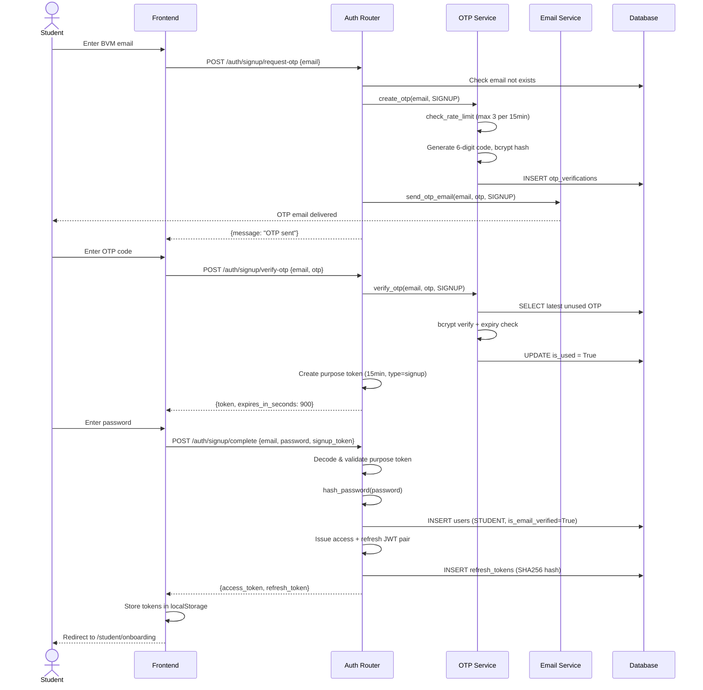

### 6.2 Login with Brute-Force Protection

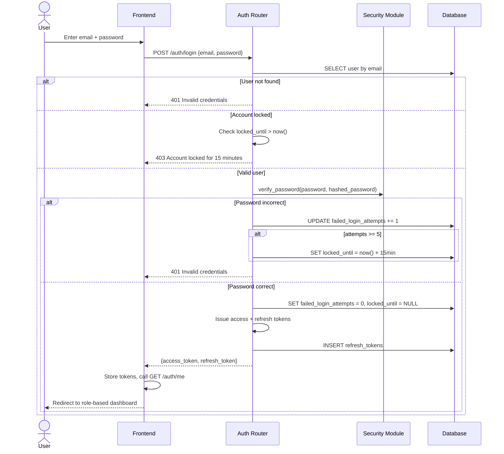

### 6.3 Resume Upload → AI Analysis

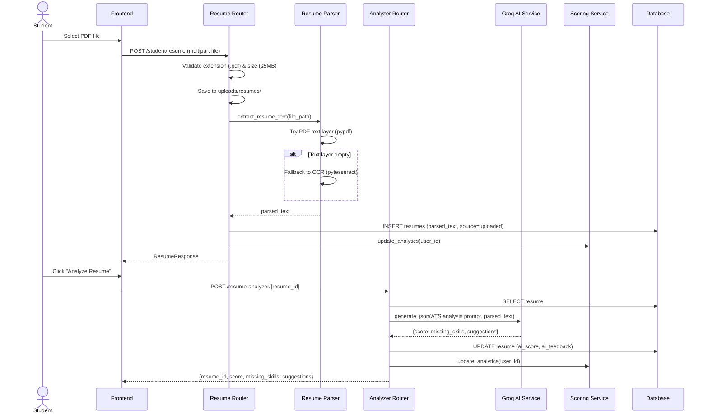

### 6.4 Student Applies to Drive → Eligibility Check

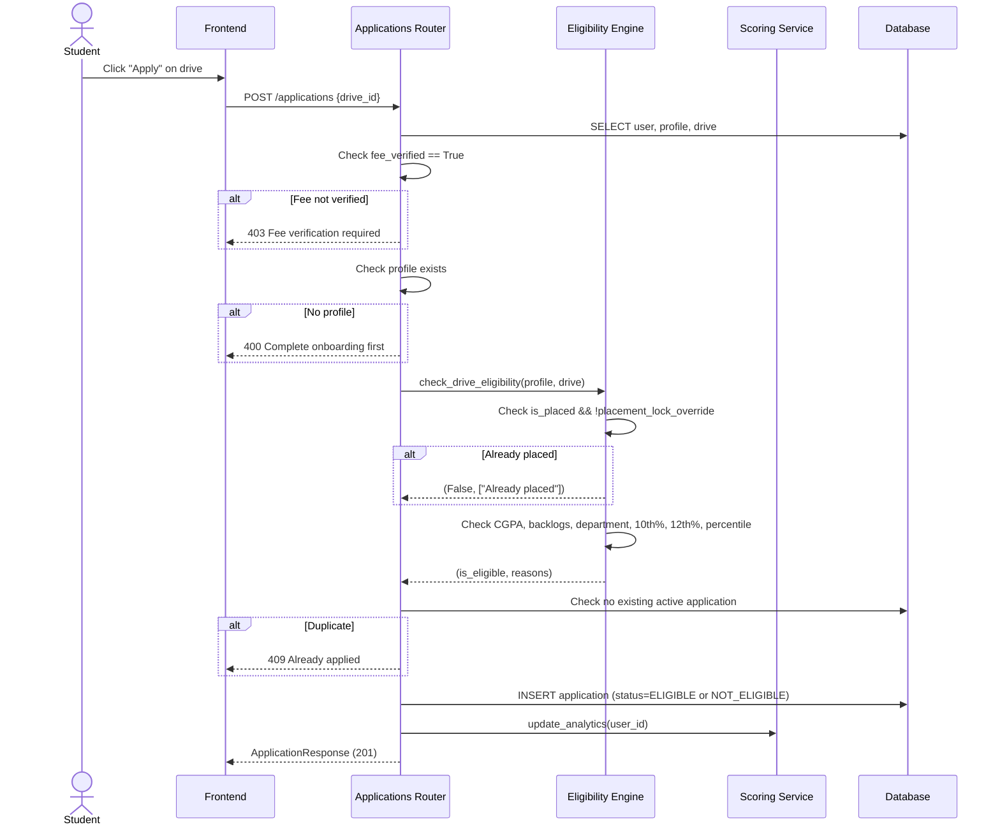

### 6.5 TPO Creates Drive

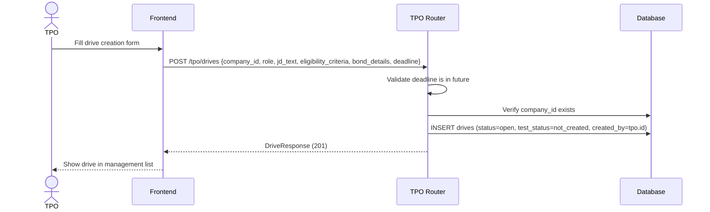

### 6.6 TPO Reviews Applicants → Selects Student

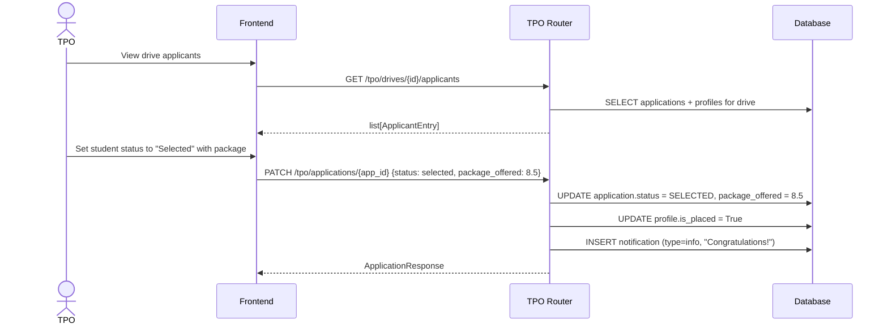

### 6.7 Mock Interview Session (Full Mode)

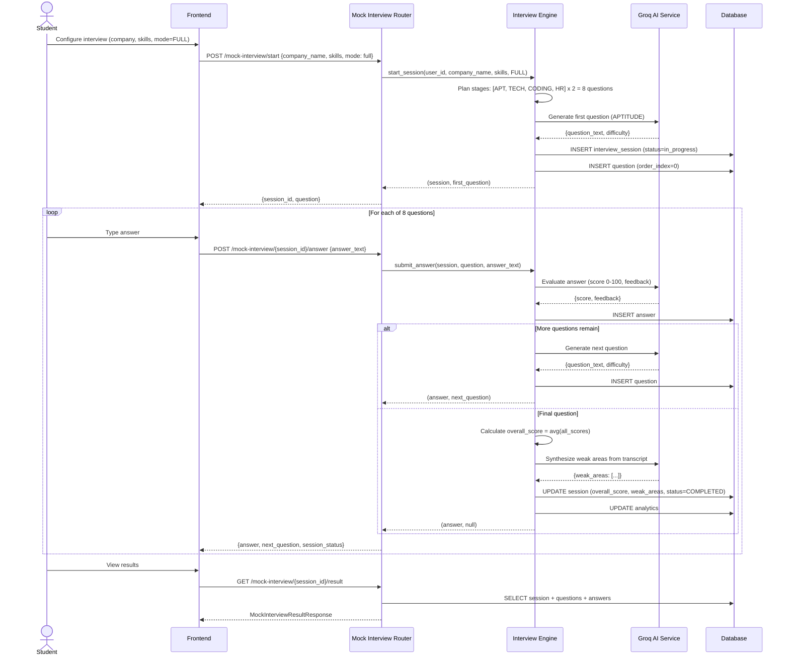

### 6.8 Resume Enhancer Flow

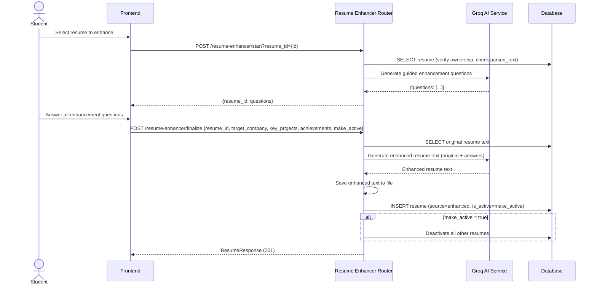

### 6.9 Instant Test: Creation → Attempt → Result

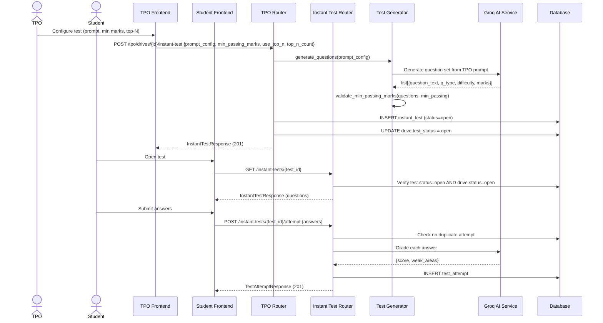

### 6.10 Fee Receipt Verification

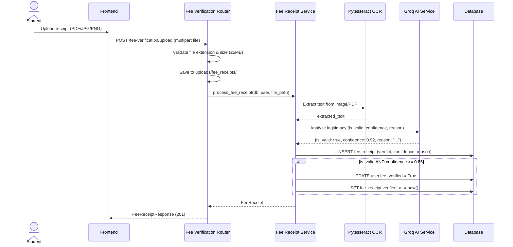

### 6.11 Career Insights (Web Search + AI Summary)

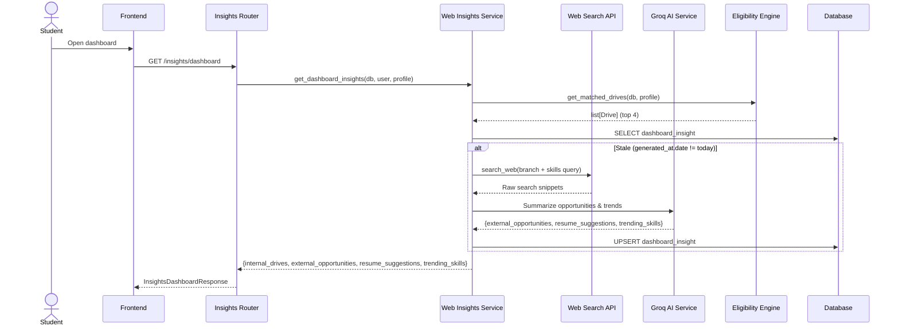

---

## 7. State Diagrams

### 7.1 Application Status

| State | Description | Terminal? |
|---|---|---|
| `applied` | Initial state on submission | No |
| `eligible` | Auto-set if passes eligibility check | No |
| `not_eligible` | Auto-set if fails eligibility check | No |
| `shortlisted` | Set by TPO after review | No |
| `rejected` | Set by TPO | Yes |
| `selected` | Set by TPO (triggers `is_placed = True`) | Yes |
| `withdrawn` | Set by Student (only from `applied`/`eligible`/`not_eligible`) | Yes |

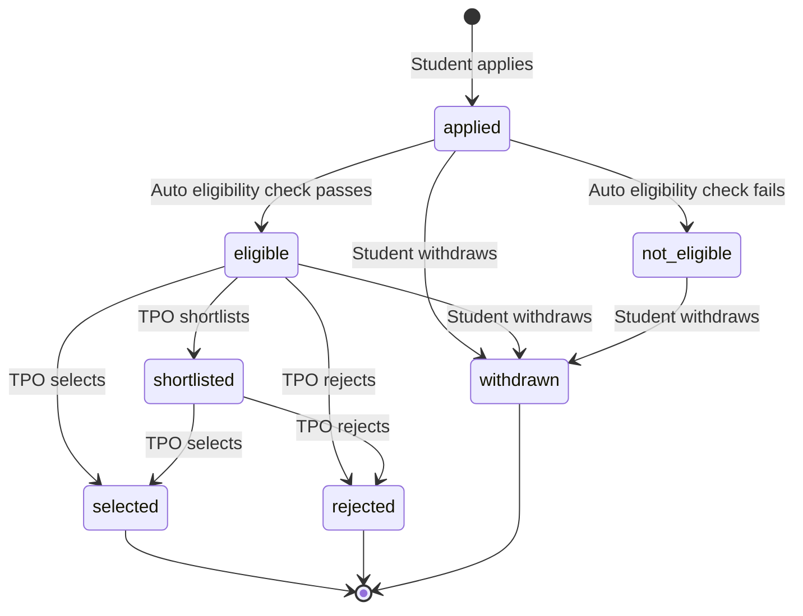

### 7.2 Drive Status

| State | Description | Terminal? |
|---|---|---|
| `open` | Accepting applications | No |
| `closed` | No longer accepting applications | Yes |

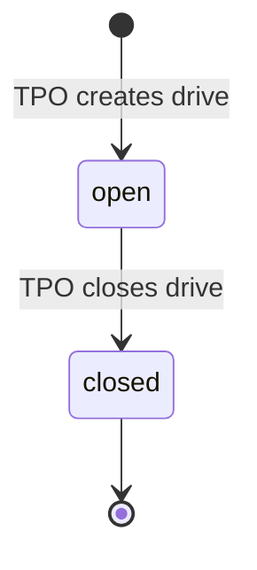

### 7.3 Drive Test Status

| State | Description | Terminal? |
|---|---|---|
| `not_created` | No instant test generated yet | No |
| `open` | Test is active and students can attempt | No |
| `closed` | Test submissions are closed | Yes |

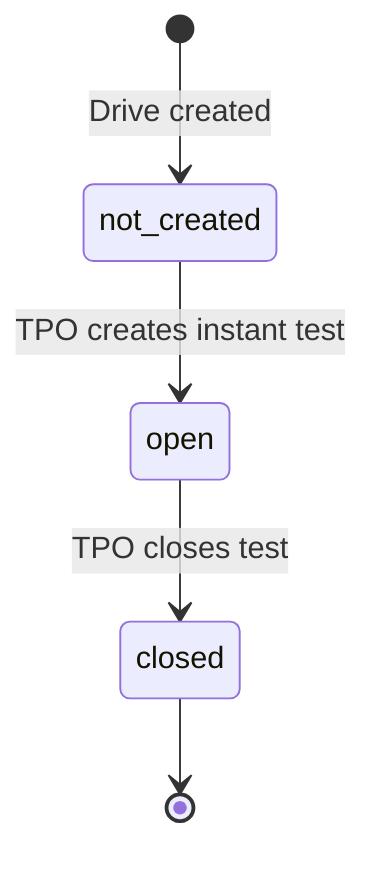

### 7.4 Instant Test Status

| State | Description | Terminal? |
|---|---|---|
| `open` | Students can submit attempts | No |
| `closed` | No more attempts accepted | Yes |

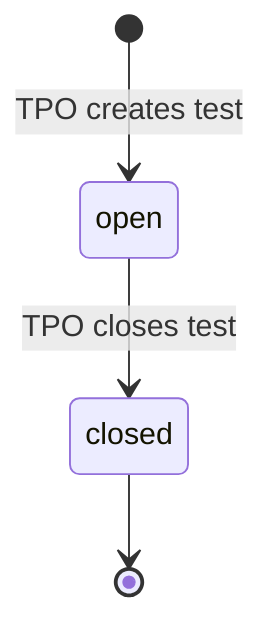

### 7.5 Interview Session Status

| State | Description | Terminal? |
|---|---|---|
| `in_progress` | Session active, questions being asked | No |
| `completed` | All questions answered, scores computed | Yes |
| `abandoned` | Session left incomplete | Yes |

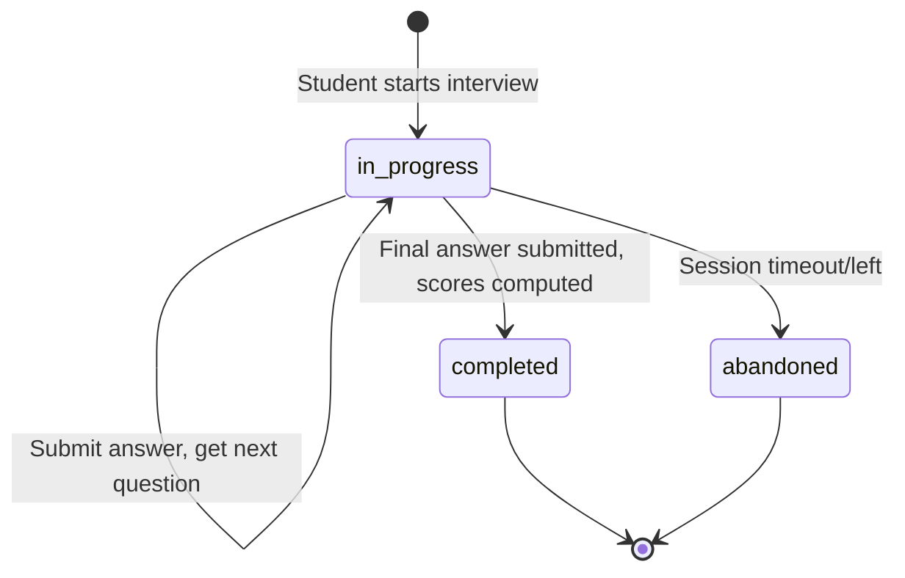

### 7.6 OTP Verification Lifecycle

| State | Description | Terminal? |
|---|---|---|
| `created` | OTP generated, hash stored, email sent | No |
| `verified (is_used=True)` | OTP successfully matched | Yes |
| `expired` | `expires_at` exceeded (10 min) | Yes |

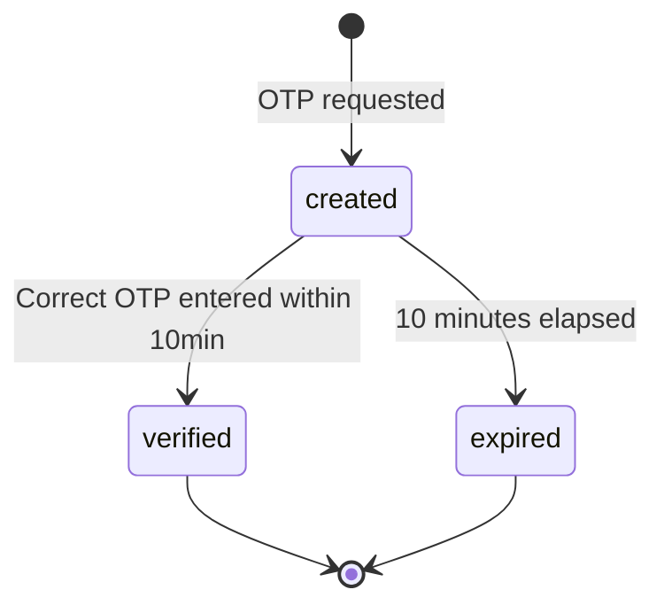

### 7.7 User Account Status

| State | Description | Terminal? |
|---|---|---|
| `active` | Normal operating state | No |
| `locked` | Temporarily locked (15 min after 5 failed logins) | No |
| `deactivated` | TPO/Admin deactivated account | Yes (unless reactivated) |

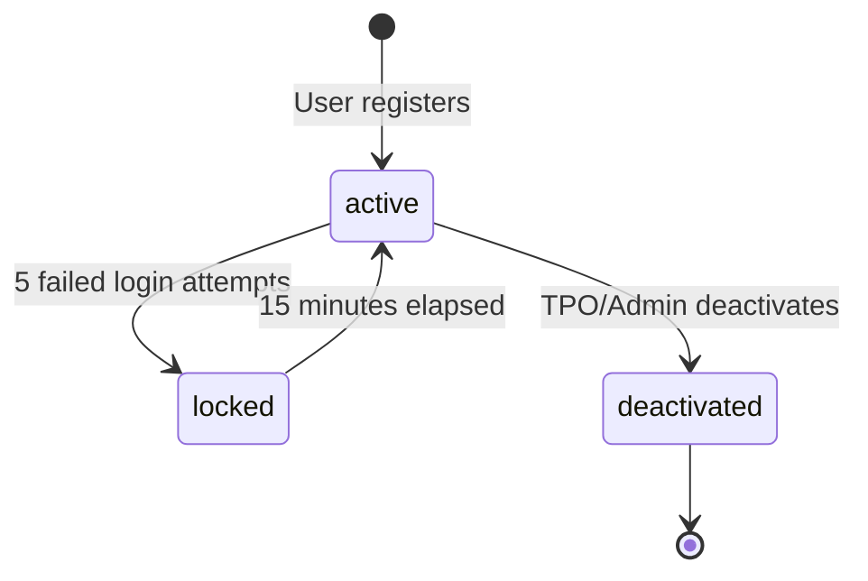

### 7.8 Contact Message Status

| State | Description | Terminal? |
|---|---|---|
| `new` | Freshly submitted | No |
| `read` | Viewed by TPO/Admin | No |
| `resolved` | Issue addressed | Yes |

```mermaid
stateDiagram-v2
    [*] --> new : Message submitted
    new --> read : TPO/Admin views
    read --> resolved : TPO/Admin resolves
    resolved --> [*]
```

### 7.9 Fee Receipt Verification

| State | Description | Terminal? |
|---|---|---|
| `uploaded` | File saved, pending AI analysis | No |
| `valid` | AI verdict = valid AND confidence ≥ 0.85 | Yes |
| `invalid` | AI verdict = invalid OR confidence < 0.85 | Yes (student can re-upload) |

```mermaid
stateDiagram-v2
    [*] --> uploaded : Student uploads receipt
    uploaded --> valid : AI says valid with confidence >= 85%
    uploaded --> invalid : AI says invalid or low confidence
    valid --> [*]
    invalid --> [*]
    note right of invalid : Student can upload a new receipt
```

---

## 8. Activity / Process Flow Diagrams

### 8.1 Complete Student Journey (Signup → Placement Readiness)

```mermaid
flowchart TD
    A[Student visits portal] --> B{Has account?}
    B -- No --> C[Enter BVM email]
    C --> D[Receive OTP via email]
    D --> E[Verify OTP]
    E --> F[Set password]
    F --> G[Account created]
    B -- Yes --> H[Login]
    H --> I{Account locked?}
    I -- Yes --> J[Wait 15 minutes]
    J --> H
    I -- No --> K{Password correct?}
    K -- No --> L[Increment failed attempts]
    L --> M{Attempts >= 5?}
    M -- Yes --> N[Lock account 15 min]
    M -- No --> H
    K -- Yes --> O{Profile complete?}
    O -- No --> P[Complete onboarding form]
    P --> Q[Profile saved]
    O -- Yes --> Q
    Q --> R{Fee verified?}
    R -- No --> S[Upload fee receipt]
    S --> T[OCR + AI verification]
    T --> U{Valid AND confidence >= 85%?}
    U -- No --> S
    U -- Yes --> V[fee_verified = True]
    R -- Yes --> V
    V --> W[Student Dashboard]
    W --> X[Upload & Analyze Resume]
    W --> Y[Browse Matched Drives]
    W --> Z[Practice Mock Interviews]
    W --> AA[View Career Insights]
    Y --> AB{Eligible for drive?}
    AB -- Yes --> AC[Apply to Drive]
    AB -- No --> AD[View reasons]
    AC --> AE[Track Application Status]
    AE --> AF{Selected?}
    AF -- Yes --> AG[is_placed = True - Locked]
    AF -- No --> AE
    X --> AH[Improve Readiness Score]
    Z --> AH
    AH --> AI[Readiness Score Updated]
```

### 8.2 TPO Drive Lifecycle (Creation → Closure)

```mermaid
flowchart TD
    A[TPO logs in] --> B[Create Company if needed]
    B --> C[Create New Drive]
    C --> D[Set eligibility criteria]
    D --> E[Set deadline & bond details]
    E --> F[Drive published - status=open]
    F --> G{Students apply}
    G --> H[View applicants list]
    H --> I{Create Instant Test?}
    I -- Yes --> J[Configure test prompt & passing marks]
    J --> K[AI generates questions]
    K --> L[Test published - test_status=open]
    L --> M{Students attempt test}
    M --> N[View test results & analytics]
    N --> O[Close test - test_status=closed]
    I -- No --> P[Continue manual review]
    O --> P
    P --> Q{Review each applicant}
    Q --> R{Decision}
    R -- Shortlist --> S[Status = shortlisted]
    S --> Q
    R -- Select --> T[Status = selected]
    T --> U[Student marked as placed]
    U --> V[Notification sent to student]
    R -- Reject --> W[Status = rejected]
    Q --> X{All reviewed?}
    X -- No --> Q
    X -- Yes --> Y[Close Drive - status=closed]
```

---

## 9. API Endpoint Inventory

### 9.1 Health (`main.py`)

| Method | Path | Role(s) | Purpose |
|---|---|---|---|
| GET | `/health` | Public | Health check |

### 9.2 Authentication (`auth.py`, prefix: `/auth`)

| Method | Path | Role(s) | Purpose | Key Fields |
|---|---|---|---|---|
| POST | `/auth/signup/request-otp` | Public | Request signup OTP | Req: `{email}` |
| POST | `/auth/signup/verify-otp` | Public | Verify signup OTP | Req: `{email, otp}` → Res: `{token, expires_in_seconds}` |
| POST | `/auth/signup/complete` | Public (token) | Complete registration | Req: `{email, password, signup_token}` → Res: `{access_token, refresh_token}` |
| POST | `/auth/login` | Public | Login | Req: `{email, password}` → Res: `{access_token, refresh_token}` |
| POST | `/auth/refresh` | Public (token) | Rotate token pair | Req: `{refresh_token}` → Res: `{access_token, refresh_token}` |
| POST | `/auth/logout` | Public (token) | Revoke refresh token | Req: `{refresh_token}` |
| GET | `/auth/me` | Authenticated | Get current user info | Res: `MeResponse` |
| PATCH | `/auth/profile` | Authenticated | Update profile fields | Req: `ProfileUpdate` |
| POST | `/auth/change-password/request-otp` | Authenticated | Request change-password OTP | — |
| POST | `/auth/change-password/verify-otp` | Authenticated | Verify change-password OTP | Req: `{email, otp}` |
| POST | `/auth/change-password/complete` | Authenticated | Finalize password change | Req: `{current_password, new_password, change_token}` |
| POST | `/auth/forgot-password/request-otp` | Public | Request password reset OTP | Req: `{email}` |
| POST | `/auth/forgot-password/verify-otp` | Public | Verify reset OTP | Req: `{email, otp}` |
| POST | `/auth/forgot-password/reset` | Public (token) | Reset password | Req: `{email, new_password, reset_token}` |

### 9.3 Student Profile (`student_profile.py`)

| Method | Path | Role(s) | Purpose | Key Fields |
|---|---|---|---|---|
| POST | `/student/profile` | Student | Create onboarding profile | Req: `ProfileCreate` → Res: `ProfileResponse` |
| GET | `/student/profile` | Student | Get own profile | Res: `ProfileResponse` |
| GET | `/student/weak-areas` | Student | Get weak areas timeline | Res: `WeakAreasResponse` |

### 9.4 Resume (`resume.py`, prefix: `/student`)

| Method | Path | Role(s) | Purpose | Key Fields |
|---|---|---|---|---|
| POST | `/student/resume` | Student | Upload resume PDF | Req: multipart file → Res: `ResumeResponse` |
| GET | `/student/resumes` | Student | List resumes | Res: `list[ResumeResponse]` |
| PATCH | `/student/resumes/{id}/activate` | Student | Toggle active resume | Res: `ResumeResponse` |

### 9.5 Fee Verification (`fee_verification.py`, prefix: `/fee-verification`)

| Method | Path | Role(s) | Purpose | Key Fields |
|---|---|---|---|---|
| POST | `/fee-verification/upload` | Student | Upload fee receipt | Req: multipart file → Res: `FeeReceiptResponse` |
| GET | `/fee-verification/status` | Student | Get verification status | Res: `{fee_verified, latest_receipt}` |

### 9.6 Drives (`drives.py`, prefix: `/drives`)

| Method | Path | Role(s) | Purpose | Key Fields |
|---|---|---|---|---|
| GET | `/drives/matched` | Student | Get eligible drives | Res: `list[DriveResponse]` |
| GET | `/drives` | Authenticated | Browse all drives | Query: `status_filter` → Res: `list[DriveWithEligibility]` |
| GET | `/drives/{id}` | Authenticated | Get drive details | Res: `DriveWithEligibility` |

### 9.7 Applications (`applications.py`)

| Method | Path | Role(s) | Purpose | Key Fields |
|---|---|---|---|---|
| POST | `/applications` | Student | Apply to drive | Req: `{drive_id}` → Res: `ApplicationResponse` |
| GET | `/student/applications` | Student | List own applications | Res: `list[ApplicationResponse]` |
| POST | `/student/applications/{id}/withdraw` | Student | Withdraw application | Res: `ApplicationResponse` |

### 9.8 Mock Interview (`mock_interview.py`, prefix: `/mock-interview`)

| Method | Path | Role(s) | Purpose | Key Fields |
|---|---|---|---|---|
| POST | `/mock-interview/start` | Student | Start interview session | Req: `{company_name, skills, mode, drive_id}` |
| POST | `/mock-interview/from-resume` | Student | Start from resume | Req: `{resume_id, company_name}` |
| POST | `/mock-interview/{id}/answer` | Student | Submit answer | Req: `{answer_text}` → Res: `{answer, next_question, session_status}` |
| GET | `/mock-interview/{id}/next-question` | Student | Get current question | Res: `QuestionResponse` |
| GET | `/mock-interview/{id}/result` | Student | Get full results | Res: `MockInterviewResultResponse` |

### 9.9 Resume Analyzer (`resume_analyzer.py`, prefix: `/resume-analyzer`)

| Method | Path | Role(s) | Purpose | Key Fields |
|---|---|---|---|---|
| POST | `/resume-analyzer/{id}` | Student | AI ATS analysis | Res: `{resume_id, score, missing_skills, suggestions}` |

### 9.10 Resume Enhancer (`resume_enhancer.py`, prefix: `/resume-enhancer`)

| Method | Path | Role(s) | Purpose | Key Fields |
|---|---|---|---|---|
| POST | `/resume-enhancer/start` | Student | Get enhancement questions | Query: `resume_id` → Res: `{resume_id, questions}` |
| POST | `/resume-enhancer/finalize` | Student | Generate enhanced resume | Req: `{resume_id, target_company, key_projects, achievements, make_active}` |

### 9.11 Instant Tests (`instant_test.py`, prefix: `/instant-tests`)

| Method | Path | Role(s) | Purpose | Key Fields |
|---|---|---|---|---|
| GET | `/instant-tests/{id}` | Student | Get test questions | Res: `InstantTestResponse` |
| POST | `/instant-tests/{id}/attempt` | Student | Submit test attempt | Req: `{answers}` → Res: `TestAttemptResponse` |

### 9.12 Resources (`resources.py`, prefix: `/resources`)

| Method | Path | Role(s) | Purpose | Key Fields |
|---|---|---|---|---|
| GET | `/resources` | Authenticated | Browse resources | Query: `category`, `content_type` |
| GET | `/resources/{id}` | Authenticated | Get resource | Res: `ResourceResponse` |
| POST | `/resources` | Admin | Create resource | Req: `ResourceCreate` |
| PATCH | `/resources/{id}` | Admin | Update resource | Req: `ResourceUpdate` |
| DELETE | `/resources/{id}` | Admin | Delete resource | — |

### 9.13 Notifications (`notifications.py`, prefix: `/notifications`)

| Method | Path | Role(s) | Purpose | Key Fields |
|---|---|---|---|---|
| GET | `/notifications` | Authenticated | Get user notifications | Res: `list[NotificationResponse]` |
| PATCH | `/notifications/{id}/read` | Authenticated | Mark as read | Res: `NotificationResponse` |

### 9.14 Insights (`insights.py`, prefix: `/insights`)

| Method | Path | Role(s) | Purpose | Key Fields |
|---|---|---|---|---|
| GET | `/insights/dashboard` | Student | Get career insights | Res: `InsightsDashboardResponse` |
| POST | `/insights/refresh` | Student | Manual refresh | Res: `InsightsDashboardResponse` |

### 9.15 Contact (`contact.py`, prefix: `/contact`)

| Method | Path | Role(s) | Purpose | Key Fields |
|---|---|---|---|---|
| POST | `/contact/submit` | Public/Optional Auth | Submit contact message | Req: `ContactMessageCreate` |
| GET | `/contact/placement` | TPO/Admin | View placement messages | Res: `list[ContactMessageResponse]` |
| GET | `/contact/general` | Admin | View general messages | Res: `list[ContactMessageResponse]` |
| GET | `/contact/all` | Admin | View all messages | Res: `list[ContactMessageResponse]` |
| PATCH | `/contact/{id}` | TPO/Admin | Update status | Req: `{status}` |

### 9.16 TPO (`tpo.py`, prefix: `/tpo`)

| Method | Path | Role(s) | Purpose | Key Fields |
|---|---|---|---|---|
| POST | `/tpo/companies` | TPO | Create company | Req: `CompanyCreate` |
| GET | `/tpo/companies` | TPO | List companies | Res: `list[CompanyResponse]` |
| GET | `/tpo/dashboard/summary` | TPO | Dashboard metrics | Res: `TpoDashboardSummary` |
| POST | `/tpo/drives` | TPO | Create drive | Req: `DriveCreate` |
| GET | `/tpo/drives` | TPO | List own drives | Res: `list[DriveResponse]` |
| GET | `/tpo/drives/{id}/eligible-students` | TPO | Eligible students | Res: `list[ProfileResponse]` |
| GET | `/tpo/drives/{id}/applicants` | TPO | Drive applicants | Res: `list[ApplicantEntry]` |
| PATCH | `/tpo/applications/{id}` | TPO | Update app status | Req: `ApplicationUpdate` |
| POST | `/tpo/drives/{id}/close` | TPO | Close drive | Res: `DriveResponse` |
| DELETE | `/tpo/drives/{id}/remove-student/{uid}` | TPO | Remove applicant | — |
| POST | `/tpo/drives/{id}/instant-test` | TPO | Create instant test | Req: `InstantTestCreate` |
| GET | `/tpo/instant-tests/{id}/results` | TPO | Test results | Res: `list[ResultEntry]` |
| GET | `/tpo/instant-tests/{id}/analytics` | TPO | Test analytics | Res: `InstantTestAnalytics` |
| POST | `/tpo/instant-tests/{id}/close` | TPO | Close test | Res: `InstantTestResponse` |
| GET | `/tpo/instant-tests/history` | TPO | Test history | Res: `list[HistoryEntry]` |
| GET | `/tpo/students/all` | TPO | All students | Res: `list[StudentCard]` |
| POST | `/tpo/students/{id}/warn` | TPO | Warn student | Req: `{message}` |
| POST | `/tpo/students/{id}/deactivate` | TPO | Deactivate student | — |
| PATCH | `/tpo/students/{id}/placement-override` | TPO | Toggle override | Req: `{placement_lock_override}` |

### 9.17 Admin (`admin.py`, prefix: `/admin`)

| Method | Path | Role(s) | Purpose | Key Fields |
|---|---|---|---|---|
| GET | `/admin/drives` | Admin | All drives | Res: `list[DriveResponse]` |
| PATCH | `/admin/drives/{id}` | Admin | Update drive | Req: `DriveUpdate` |
| DELETE | `/admin/drives/{id}` | Admin | Delete drive | — |
| GET | `/admin/students` | Admin | Filtered students | Query: `branch`, `is_placed` |
| GET | `/admin/students/all` | Admin | All student cards | Res: `list[StudentCard]` |
| POST | `/admin/students/{id}/warn` | Admin | Warn student | Req: `{message}` |
| POST | `/admin/students/{id}/deactivate` | Admin | Deactivate student | — |
| PATCH | `/admin/students/{id}/placement-override` | Admin | Toggle override | Req: `{placement_lock_override}` |
| POST | `/admin/tpo/{id}/notify` | Admin | Notify TPO | Req: `{message}` |
| GET | `/admin/activity` | Admin | Activity audit feed | Res: `list[ActivityEntry]` (top 100) |
| GET | `/admin/analytics` | Admin | Global analytics | Res: `AdminAnalyticsResponse` |

### 9.18 Analytics (`analytics.py`, prefix: `/analytics`)

| Method | Path | Role(s) | Purpose | Key Fields |
|---|---|---|---|---|
| GET | `/analytics/me` | Student | Readiness score | Res: `AnalyticsResponse` |
| GET | `/analytics/tpo/{drive_id}` | TPO | Per-drive analytics | Res: `DriveAnalyticsResponse` |

---

## 10. Non-Functional Requirements / Security Rules

### 10.1 Authentication & Token Security

| Parameter | Value |
|---|---|
| JWT Algorithm | HS256 |
| Access Token Expiry | 30 minutes |
| Refresh Token Expiry | 7 days |
| Purpose Token Expiry | 15 minutes (signup, forgot_password, change_password) |
| Refresh Token Storage | SHA256 hash stored in `refresh_tokens` table; revoked on logout |
| Token Rotation | On refresh, old token is revoked and new pair is issued |
| Password Hashing | bcrypt via passlib |

### 10.2 Brute-Force Protection

| Parameter | Value |
|---|---|
| Max Failed Login Attempts | 5 consecutive |
| Lockout Duration | 15 minutes |
| Counter Reset | On successful login |

### 10.3 OTP Security

| Parameter | Value |
|---|---|
| OTP Length | 6 digits (cryptographically random) |
| OTP Expiry | 10 minutes |
| OTP Hashing | bcrypt |
| Rate Limit | Max 3 OTP requests per email per purpose per 15-minute window |

### 10.4 Email Domain Restriction

| Rule | Detail |
|---|---|
| Pattern | `^[A-Za-z0-9._%+-]+@bvmengineering\.ac\.in$` |
| Scope | Student signup only |

### 10.5 Password Rules

| Rule | Detail |
|---|---|
| Minimum Length | 8 characters |
| Complexity | At least 1 digit required |

### 10.6 File Upload Constraints

| Parameter | Value |
|---|---|
| Max File Size | 5 MB |
| Resume Extensions | `.pdf` |
| Fee Receipt Extensions | `.pdf`, `.jpg`, `.jpeg`, `.png` |
| Storage | Local disk under `uploads/` with UUID-based filenames |

### 10.7 Validation Rules

| Field | Constraint |
|---|---|
| CGPA | 0.0 – 10.0 |
| 10th/12th Percentage | 0.0 – 100.0 |
| Competitive Exam Percentile | 0.0 – 100.0 (optional) |
| Active Backlogs | ≥ 0 |
| Drive Deadline | Must be a future datetime at creation |
| Package Offered | ≥ 0, can only be set when `status = SELECTED` |
| Competitive Exam Percentile | Requires `competitive_exam_name` if specified |
| Resource Content | `video_url` required when `content_type = VIDEO`; `content` required when `content_type = BLOG/DOCUMENT` |
| Instant Test `top_n_count` | Required and > 0 when `use_top_n = True`; prohibited when `use_top_n = False` |
| `min_passing_marks` | Must not exceed `total_possible_marks` from generated questions |

### 10.8 Placement Policy ("Locked Once Placed")

- `profile.is_placed` auto-set to `True` on first `SELECTED` application
- Further drive applications blocked unless `profile.placement_lock_override = True`
- Override can be toggled by TPO or Admin

### 10.9 Application Withdrawal Rules

- Allowed from states: `applied`, `eligible`, `not_eligible`
- Blocked from states: `shortlisted`, `selected`, `rejected`, `withdrawn`

### 10.10 CORS Configuration

| Parameter | Value |
|---|---|
| Allowed Origins | `http://localhost:5173`, `http://127.0.0.1:5173` |
| Credentials | `True` |
| Methods | `*` (all) |
| Headers | `*` (all) |

### 10.11 AI Service Configuration

| Parameter | Value |
|---|---|
| Provider | Groq |
| Model | `llama-3.3-70b-versatile` |
| Default Temperature | 0.4 |
| Max Retries | 2 (total 3 attempts) |
| Response Format | `json_object` |
| Fee Confidence Threshold | 0.85 |

### 10.12 Career Insights Rate Limiting

| Parameter | Value |
|---|---|
| Manual Refresh Cooldown | 12 hours |
| Auto Daily Refresh | Once per day (staleness check on `generated_at.date()`) |
| Internal Drives Limit | 4 matched drives returned |

### 10.13 Readiness Score Formula

```
Readiness Score = (Resume AI Score × 0.30)
               + (Avg Interview Score × 0.30)
               + (Profile Completeness × 0.20)
               + (Application Activity × 0.20)
```

- **Profile Completeness**: % of 6 fields filled (`full_name`, `branch`, `cgpa`, `tenth_percentage`, `twelfth_percentage`, `skills`)
- **Application Activity**: `min(total_applications × 10, 100)`
- **Clamped**: 0.0 – 100.0, rounded to 2 decimal places

---

## 11. Known Discrepancies

### 11.1 Execution Tracker vs. Actual Code

The `execution_tracker.md` file shows **all phase checklist items as unchecked (`[ ]`)** across all 10 phases. However, the codebase has substantial implementation across Phases 1–8:
- **Phase 1 (Backend Foundation)**: Fully implemented — all 19 models, Alembic migration, DB session, config
- **Phase 2 (Validation Layer)**: Fully implemented — all Pydantic schemas exist
- **Phase 3 (Backend Services)**: Fully implemented — all 9 service modules present
- **Phase 4 (Backend Routers)**: Fully implemented — all 17 router files mounted in `main.py`
- **Phase 5 (Frontend Foundation)**: Implemented — Vite, Tailwind, Axios interceptors, AuthContext, ProtectedRoute, layouts
- **Phase 6 (Frontend Public + Auth + Student Pages)**: Mostly implemented — Landing, Contact, Login, Signup OTP, Forgot Password, Onboarding, Fee Upload, Dashboard, Drives, Applications, Resources, Profile pages exist
- **Phase 7 (Frontend AI Features)**: **Not implemented** — No dedicated Mock Interview, Resume Analyzer, Resume Enhancer, Instant Test attempt, or Weak Areas page components found in the frontend
- **Phase 8 (Frontend TPO + Admin Pages)**: TPO pages partially built (Dashboard, ManageDrives, DriveDetail, AllStudents, PastTests); Admin pages are all fallback `FoundationNotice` placeholders
- **Phase 9 (Production Hardening)**: Not implemented — no Dockerfile, no pytest suite, no rate limiting middleware
- **Phase 10 (Final Cross-Check)**: Not started

### 11.2 Frontend API Calls Without Matching Backend Paths

| Frontend API Call | Frontend Path | Backend Actual Path | Status |
|---|---|---|---|
| `tpoApi.getAnalytics(driveId)` | `GET /tpo/analytics/${driveId}` | `GET /analytics/tpo/{drive_id}` | **Path mismatch** — frontend uses `/tpo/analytics/` but backend uses `/analytics/tpo/` |
| `tpoApi.closeTest(driveId)` | `POST /tpo/drives/${driveId}/close-test` | `POST /tpo/instant-tests/${testId}/close` | **Parameter mismatch** — frontend passes `driveId` but backend expects `testId` |

### 11.3 Admin Frontend Pages

All admin routes (`/admin/*`) except `/admin/profile` render the `FoundationNotice` placeholder. The backend has a fully implemented Admin router with 11 endpoints, but no corresponding React page components exist in `src/pages/admin/`.

### 11.4 AI Feature Frontend Pages (Phase 7)

The backend has fully implemented routers for:
- Mock Interview (start, answer, result)
- Resume Analyzer (AI ATS scoring)
- Resume Enhancer (Q&A + finalize)
- Instant Test (student attempt)
- Weak Areas

However, **no dedicated frontend page components** exist for any of these features. The frontend API files (`interview.api.js`, `resume.api.js`) define the client calls, but corresponding page components (e.g., `MockInterviewPage.jsx`, `ResumeAnalyzerPage.jsx`, `InstantTestAttemptPage.jsx`, `WeakAreasPage.jsx`) have not been created yet.

### 11.5 Student Dashboard Hardcoded Values

The `StudentDashboard.jsx` displays hardcoded mock values:
- "Placement Readiness: 75%" (not fetched from `/analytics/me`)
- "Active Applications: 3" (not fetched from `/student/applications`)
- "Tests Attempted: 2" (not dynamic)

These should be wired to actual backend APIs.

### 11.6 Change Password Page

A `ChangePasswordPage.jsx` exists in the frontend pages but is **not routed** in `App.jsx`. There is no route path mapped to this component.
